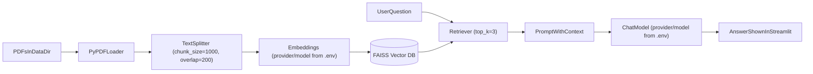

## Assignment 1: RAG Chatbot (Streamlit + Configurable LLM)

This project is a **Retrieval-Augmented Generation (RAG)** chatbot built with **Streamlit**, **LangChain**, and a **local FAISS vector store**.

It answers questions using only the content from the PDFs in `data/`:
- `data/HR_Policies_Handbook.pdf`
- `data/AI_Startup.pdf`

### High-level flow



**Flow steps (detailed)**

1. **Document loading**  
   PDFs in `data/` (e.g. `HR_Policies_Handbook.pdf`, `AI_Startup.pdf`) are loaded with **PyPDFLoader**. Each page becomes a document; metadata (e.g. source path, page) is kept for later reference.

2. **Text splitting**  
   Document text is split into overlapping chunks with **RecursiveCharacterTextSplitter** (`chunk_size=1000`, `chunk_overlap=200`). Overlap reduces context loss at chunk boundaries and improves retrieval.

3. **Embedding**  
   Each chunk is turned into a vector using the **embedding model** set in `.env` (`EMBEDDING_PROVIDER` and `EMBEDDING_MODEL`). The same embedding model is used for indexing and for querying so distances are comparable.

4. **Vector store (FAISS)**  
   Vectors and their chunk text are stored in a **local FAISS** index (saved under the chosen vectorstore directory). FAISS supports fast approximate nearest-neighbour search for similarity retrieval.

5. **User question and retrieval**  
   When the user asks a question in the Streamlit UI, the question is embedded with the **same embedding model**. The **retriever** runs a similarity search over the FAISS index and returns the **top k=3** most relevant chunks (configurable via `TOP_K`).

6. **Prompt and LLM**  
   The retrieved chunks are concatenated into a **context** string. A **prompt** is built that instructs the model to answer using only this context (and to say it doesn’t know if the answer isn’t there). The **chat model** (OpenAI, Ollama, or Gemini, from `.env`) generates the final answer from this prompt.

7. **Answer in Streamlit**  
   The model’s reply is streamed back and shown in the **Streamlit** chat interface. Chat history is kept in session state so the user can see prior questions and answers.

### What gets built

- **Chat vectorstore**: one per provider, e.g. `vectorstore_openai`, `vectorstore_ollama`, `vectorstore_gemini`, after you click “Build vectorstore” for that provider.
- **Comparison vectorstore**: single index at `vectorstore_comparison/` (OpenAI embeddings only), built from the sidebar “Build comparison vectorstore”.
- **Retriever**: top \(k=3\) chunks (configurable via `TOP_K`).
- **LLM**: configurable via `.env` (OpenAI / Ollama / Gemini).

---

## Setup

### 1) Create a virtual environment

```bash
python3 -m venv .venv
source .venv/bin/activate
```

### 2) Install dependencies

```bash
pip install -r requirements.txt
```

### 3) Set environment variables (.env)

This app reads environment variables from `.env` (via `python-dotenv`).

You can choose an LLM provider:

- **OpenAI**:
  - Set `OPENAI_API_KEY`
  - `LLM_PROVIDER=openai`
- **Ollama** (local):
  - Install Ollama and pull a model (example: `ollama pull gemma`)
  - `LLM_PROVIDER=ollama`
  - Optional: `OLLAMA_BASE_URL` (default `http://localhost:11434`)
- **Gemini**:
  - Set `GOOGLE_API_KEY`
  - `LLM_PROVIDER=gemini`

Embeddings are also configurable (recommended to keep them consistent with your vectorstore). If you change embedding provider/model, rebuild the vectorstore.

**Vectorstores:**
- **Individual chat**: Uses a **model-specific** vectorstore per provider: `vectorstore_openai`, `vectorstore_ollama`, `vectorstore_gemini` (default when `VECTORSTORE_DIR` is not set). Build from the app with “Build vectorstore” for the current provider.
- **Comparison**: Uses a **single shared** vectorstore (default `vectorstore_comparison`) with **OpenAI embeddings only** (so all three LLMs run against the same index). The comparison index uses `COMPARISON_EMBEDDING_MODEL`, not `EMBEDDING_MODEL`. Build once from the sidebar with “Build comparison vectorstore”, then run “Run comparison”.

**Optional configuration:**

| Variable | Description | Default |
|----------|-------------|---------|
| **LLM_PROVIDER** | `openai` \| `ollama` \| `gemini` | `openai` |
| **LLM_MODEL** | Model name for the selected provider | provider-specific |
| **EMBEDDING_PROVIDER** | `openai` \| `ollama` \| `gemini` | `openai` |
| **EMBEDDING_MODEL** | Embedding model for **chat** vectorstore | provider-specific |
| **CHUNK_SIZE** | Chunk size for splitting | `1000` |
| **CHUNK_OVERLAP** | Overlap between chunks | `200` |
| **TOP_K** | Number of chunks retrieved per query | `3` |
| **DATA_DIR** | Directory containing PDFs | `./data` |
| **VECTORSTORE_DIR** | Override for **chat** vectorstore path | `vectorstore_<LLM_PROVIDER>` |
| **COMPARISON_VECTORSTORE_DIR** | Path for **comparison** vectorstore | `vectorstore_comparison` |
| **COMPARISON_EMBEDDING_MODEL** | OpenAI embedding model for comparison index only | `text-embedding-3-small` |
| **LOG_LEVEL** | Logging level: `DEBUG`, `INFO`, `WARNING` | `INFO` |

### Example `.env` configurations

- **OpenAI only (default)**:

  ```env
  LLM_PROVIDER=openai
  LLM_MODEL=gpt-4o-mini
  EMBEDDING_PROVIDER=openai
  EMBEDDING_MODEL=text-embedding-3-small
  OPENAI_API_KEY=your_openai_key_here
  ```

- **Ollama local (gemma)**:

  ```env
  LLM_PROVIDER=ollama
  LLM_MODEL=gemma
  EMBEDDING_PROVIDER=ollama
  EMBEDDING_MODEL=nomic-embed-text
  OLLAMA_BASE_URL=http://localhost:11434
  ```

- **Gemini (gemini-2.5-flash)**:

  ```env
  LLM_PROVIDER=gemini
  LLM_MODEL=gemini-2.5-flash
  EMBEDDING_PROVIDER=gemini
  EMBEDDING_MODEL=gemini-embedding-001
  GOOGLE_API_KEY=your_gemini_key_here
  ```

After changing provider or embedding model, rebuild the vectorstore from the app so FAISS uses consistent embeddings.

---

## Run the Streamlit app

From the `agentic-ai-bootcamp/assignment1/` folder:

```bash
streamlit run app.py
```

### Logging

The app and pipeline log to the terminal (e.g. config load, vectorstore build/load, comparison runs). Set `LOG_LEVEL=DEBUG` for more detail or `LOG_LEVEL=WARNING` to reduce noise. Default is `INFO`.

### macOS note (FAISS / OpenMP)

If Streamlit aborts with an OpenMP error like:

> `OMP: Error #15: Initializing libomp.dylib, but found libomp.dylib already initialized.`

This project sets `KMP_DUPLICATE_LIB_OK=TRUE` in `app.py` as a workaround so the app can run locally. If you prefer not to rely on it, the “proper” fix is to ensure only one OpenMP runtime is linked/loaded in your environment.

### First run

- Set `LLM_PROVIDER` (and the right API key) in `.env`, then start the app.
- Click **Build vectorstore** to build the index for the current provider (reads PDFs from `data/`, chunks, embeds, and saves to e.g. `vectorstore_openai`).
- Ask questions in the chat; history is shown above the input.
- For comparison: in the sidebar, click **Build comparison vectorstore** once (OpenAI embeddings), then **Run comparison (all 3 models)** to run the test questions and see the table.

---

## Testing & Comparison

To compare **OpenAI**, **Ollama**, and **Gemini** on the same RAG pipeline:

1. **Build the comparison vectorstore once**: In the Streamlit app sidebar, click **Build comparison vectorstore** (uses OpenAI embeddings only, saves to `vectorstore_comparison/`). Requires `OPENAI_API_KEY`; the model is `COMPARISON_EMBEDDING_MODEL` (default `text-embedding-3-small`).
2. Ensure `.env` has the keys you need for all three LLMs (e.g. `OPENAI_API_KEY`, `GOOGLE_API_KEY`; for Ollama, have the server running and the model pulled).
3. Run the comparison from the **sidebar** (“Run comparison (all 3 models)”) or from the CLI:

   ```bash
   python run_comparison.py
   ```

4. The script runs **at least 3 test questions** (and a couple extra):
   - **Leave policies** – What are the leave policies? How many days of annual leave do employees get?
   - **Remote work rules** – What are the remote work rules? Is remote work allowed and under what conditions?
   - **Startup pricing model** – What is the startup's pricing model? How does the company price its product?
   - *(optional)* Sick leave; company values.

5. **Output**:
   - `comparison_results.json` – full responses and timings for each question × model.
   - In the app: a single table (Question, Model, Time (s), Response) in the sidebar.
   - In the CLI: a printed Response Speed summary table.

6. **Fill the comparison table** in `COMPARISON_TABLE.md`:
   - **Accuracy** – Rate correctness from the responses (e.g. 1–5 or Good/Fair/Poor).
   - **Hallucination** – None / Minor / Major.
   - **Response Speed** – From the script output or `comparison_results.json`.
   - **Cost per Query** – Estimate for OpenAI/Gemini; Ollama = $0 (local).
   - **Ease of Setup** – Short note per model.

---

## Files

| File | Description |
|------|-------------|
| `app.py` | Streamlit UI: chat (question input + answer), sidebar for building comparison vectorstore and running comparison. |
| `rag_pipeline.py` | RAG pipeline: config, document load/split, embeddings, FAISS build/load, retriever, LLM, `rag_answer`. |
| `run_comparison.py` | Runs test questions against all three models; callable from the app or CLI; writes `comparison_results.json`. |
| `COMPARISON_TABLE.md` | Template for manual comparison (Accuracy, Hallucination, Response Speed, Cost per Query, Ease of Setup). |
| `.env` | Environment variables (API keys, providers, models, paths). Not committed; copy from examples below. |
| `data/` | Source PDFs (`HR_Policies_Handbook.pdf`, `AI_Startup.pdf`). |

