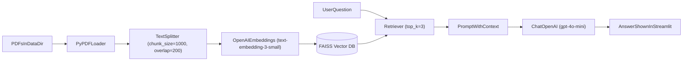

## Assignment 1: RAG Chatbot (OpenAI + Streamlit)

This project is a **Retrieval-Augmented Generation (RAG)** chatbot built with **Streamlit**, **LangChain**, **OpenAI embeddings**, and a **local FAISS vector store**.

It answers questions using only the content from the PDFs in `data/`:
- `data/HR_Policies_Handbook.pdf`
- `data/AI_Startup.pdf`

### High-level flow



### What gets built

- **Vectorstore**: saved locally under `vectorstore/` after you click “Build vectorstore” the first time.
- **Retriever**: uses top \(k=3\) chunks.
- **LLM**: OpenAI chat model (default `gpt-4o-mini`).

---

## Setup

### 1) Create a virtual environment

```bash
python3 -m venv .venv
source .venv/bin/activate
```

### 2) Install dependencies

```bash
pip install -r requirements.txt
```

### 3) Set environment variables

You must set your OpenAI API key:

```bash
export OPENAI_API_KEY="YOUR_KEY"
```

Optional configuration:
- **OPENAI_CHAT_MODEL**: defaults to `gpt-4o-mini`
- **EMBEDDING_MODEL**: defaults to `text-embedding-3-small`
- **CHUNK_SIZE**: defaults to `1000`
- **CHUNK_OVERLAP**: defaults to `200`
- **TOP_K**: defaults to `3`
- **DATA_DIR**: defaults to `./data`
- **VECTORSTORE_DIR**: defaults to `./vectorstore`

---

## Run the Streamlit app

From the `agentic-ai-bootcamp/assignment1/` folder:

```bash
streamlit run app.py
```

### macOS note (FAISS / OpenMP)

If Streamlit aborts with an OpenMP error like:

> `OMP: Error #15: Initializing libomp.dylib, but found libomp.dylib already initialized.`

This project sets `KMP_DUPLICATE_LIB_OK=TRUE` in `app.py` as a workaround so the app can run locally. If you prefer not to rely on it, the “proper” fix is to ensure only one OpenMP runtime is linked/loaded in your environment.

### First run

- Click **Build vectorstore** (this reads PDFs, chunks them, embeds them, and builds a FAISS index).
- Then ask questions using the **Question** input box.

---

## Files

- `app.py`: Streamlit UI (question input + answer display).
- `rag_pipeline.py`: RAG pipeline (load PDFs → split → embed → FAISS → retrieve → LLM).
- `data/`: source PDFs.

