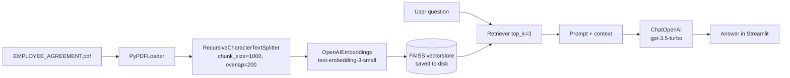

# RAG Chatbot

A **Retrieval-Augmented Generation (RAG)** chatbot built with **LangChain**, **FAISS**, **OpenAI**, and **Streamlit**.

It answers questions grounded strictly in the content of a PDF document — no hallucination beyond the source material.

---

## How it works



1. **Load** — `PyPDFLoader` reads `data/EMPLOYEE_AGREEMENT.pdf` page by page.
2. **Split** — `RecursiveCharacterTextSplitter` cuts pages into overlapping chunks (size 1000, overlap 200).
3. **Embed** — Each chunk is embedded with OpenAI `text-embedding-3-small`.
4. **Store** — Vectors are saved to a local FAISS index under `vectorstore/`.
5. **Retrieve** — At query time, the question is embedded and the top 3 most similar chunks are retrieved.
6. **Answer** — The chunks are injected into a prompt and `gpt-3.5-turbo` generates the answer.

---

## Project structure

```
rag_chatbot/
├── main.py            # Full Streamlit app (init + chat, sidebar controls)
├── app.py             # Minimal Streamlit app (assumes vectorstore already built)
├── rag_init.ipynb     # Step-by-step notebook: build and save the vectorstore
├── rag_build.ipynb    # Alternative notebook: build vectorstore from scratch
├── requirements.txt   # Python dependencies
├── .env               # API keys (not committed)
├── data/
    └── EMPLOYEE_AGREEMENT.pdf   # Source document

```

---

## Setup

### 1. Prerequisites

- Python **3.10+**
- An **OpenAI API key** — get one at [platform.openai.com/api-keys](https://platform.openai.com/api-keys)

### 2. Install dependencies

```bash
pip install -r requirements.txt
```

### 3. Configure `.env`

Create a `.env` file in the `rag_chatbot/` directory:

```env
OPENAI_API_KEY=your_openai_api_key_here

# Optional overrides (defaults shown)
EMBEDDING_MODEL=text-embedding-3-small
CHAT_MODEL=gpt-3.5-turbo
PDF_PATH=rag_chatbot/data/EMPLOYEE_AGREEMENT.pdf
VECTORSTORE_PATH=rag_chatbot/vectorstore
```

---

## Running the app

### Option A — Full app (`main.py`)

Includes a sidebar to build or rebuild the vectorstore from within the UI. Use this for first-time setup.

```bash
streamlit run main.py
```

1. Open the app in your browser.
2. In the sidebar, click **Initialize Vector Store** to load the PDF, embed it, and save the FAISS index.
3. Once initialized, type questions in the chat input.

You can also upload a different PDF through the sidebar if the default path is not found.

### Option B — Minimal app (`app.py`)

Assumes the vectorstore already exists at `vectorstore/`. Run this after the index has been built.

```bash
# Must be run from the rag_chatbot/ directory
cd rag_chatbot
streamlit run app.py
```

---

## Building the vectorstore via notebook

Both notebooks walk through the pipeline step by step:

| Notebook | Description |
|----------|-------------|
| `rag_init.ipynb` | Load → split → embed → save FAISS index |
| `rag_build.ipynb` | Same pipeline, slightly different split approach |

Run either from the `rag_chatbot/` directory:

```bash
jupyter notebook rag_init.ipynb
```

After running all cells, the `vectorstore/` directory will be created and ready for `app.py`.

---

## Configuration reference

| Variable | Description | Default |
|----------|-------------|---------|
| `OPENAI_API_KEY` | OpenAI API key (required) | — |
| `EMBEDDING_MODEL` | OpenAI embedding model | `text-embedding-3-small` |
| `CHAT_MODEL` | OpenAI chat model | `gpt-3.5-turbo` |
| `PDF_PATH` | Path to the source PDF | `rag_chatbot/data/EMPLOYEE_AGREEMENT.pdf` |
| `VECTORSTORE_PATH` | Path to the FAISS index directory | `rag_chatbot/vectorstore` |
